# AEGIS Platform Overview — Architecture Diagrams

**Document owner:** Architecture  
**Status:** Draft  
**Last updated:** 2026-08-26

This document provides **visual architecture diagrams** for the full AEGIS platform — services, integrations, databases, agents, events, and data flows.

> **Scope:** These diagrams describe the **target architecture** defined in requirements and ADRs. They represent what we are building, not what is implemented today.

---

## How to read these diagrams

| Diagram | Purpose | Standard |
|---|---|---|
| §1 System context | Who uses AEGIS and what external systems it connects to | C4 Level 1 |
| §2 Container view | Major runtime components and how they communicate | C4 Level 2 |
| §3 Application layers | Internal code structure and dependency direction | Layered architecture |
| §4 Service map | Repository modules mapped to runtime responsibilities | Module view |
| §5 Data stores | What data lives where and why | Data architecture |
| §6 Entity model | Core database entities and relationships | ER diagram |
| §7 Incident sequence | End-to-end request and event flow | UML sequence |
| §8 Agent orchestration | Multi-agent investigation workflow | Flowchart |
| §9 Event-driven flow | EventBridge → SQS → workers | Event architecture |
| §10 Tool gateway | Policy, auth, and external tool access | Security architecture |
| §11 RAG pipeline | Ingestion, indexing, retrieval | Data pipeline |
| §12 AWS deployment | Target cloud infrastructure topology | Infrastructure view |
| §13 Production simulator | Dev/test environment integration | Environment view |

**Recommended reading order:** §1 → §2 → §7 → §8 → §5 → §12

---

## 1. System context (C4 Level 1)

Actors and external systems surrounding AEGIS.

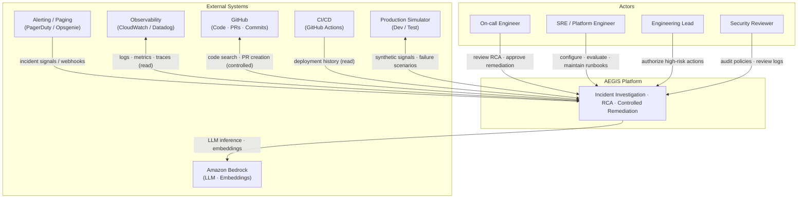

---

## 2. Container view (C4 Level 2)

Major runtime containers inside AEGIS and their connections.

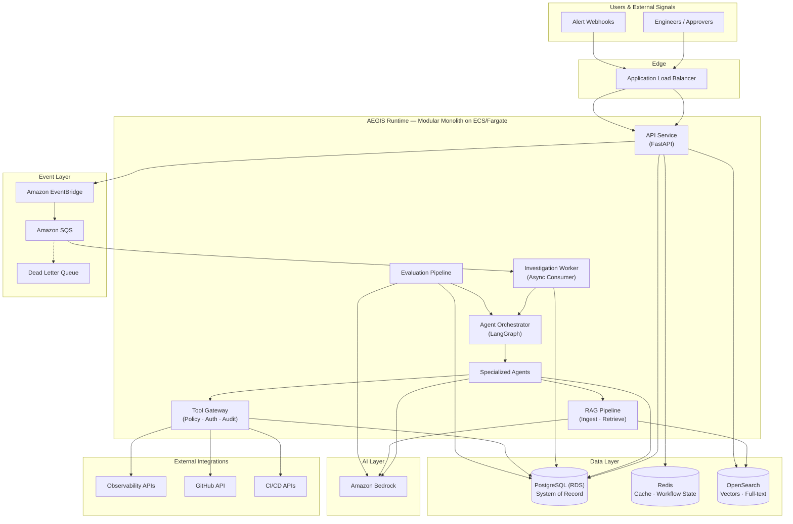

---

## 3. Application layers

Internal layering — dependencies point **inward only**.

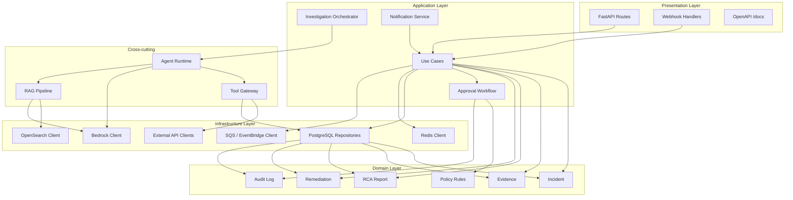

---

## 4. Service & module map

Repository structure mapped to runtime responsibilities.

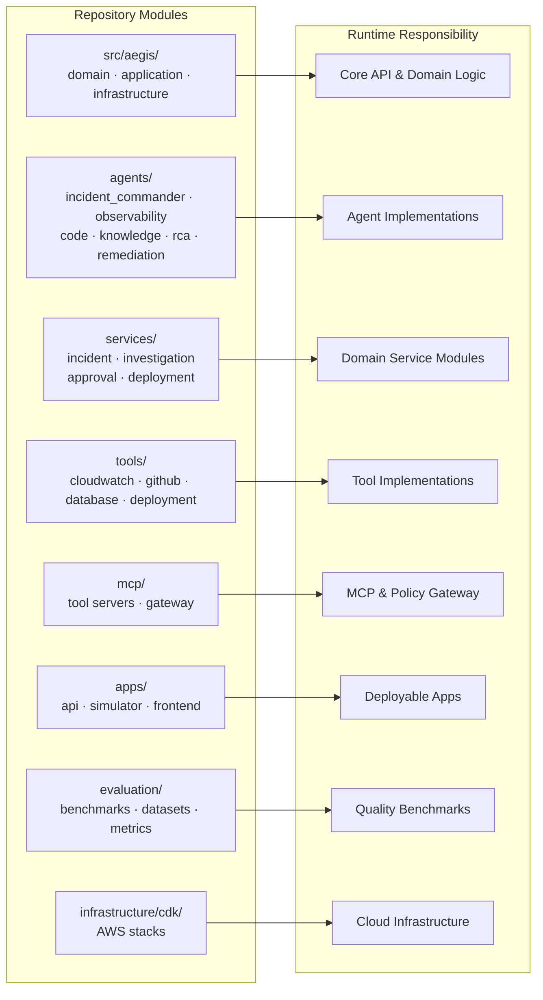

---

## 5. Data stores & data flow

What data lives where, and how it moves through the system.

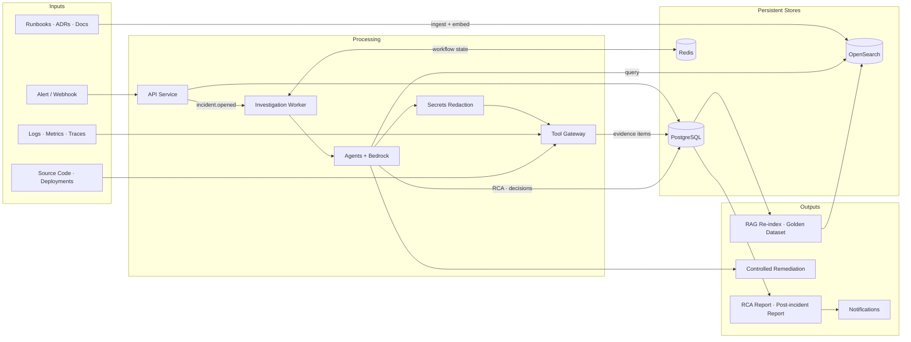

### Data ownership summary

| Store | Data | Retention |
|---|---|---|
| **PostgreSQL** | Incidents, evidence, RCA, approvals, audit logs, users/roles | Incident lifecycle + 90d audit minimum |
| **OpenSearch** | Document chunks, embeddings, retrieval metadata | Refreshed on re-index |
| **Redis** | Investigation workflow cache, session state, rate limit counters | Duration of investigation |
| **External** | Raw telemetry, source code | Not permanently stored in AEGIS |

---

## 6. Entity relationship model (conceptual)

Core domain entities in PostgreSQL.

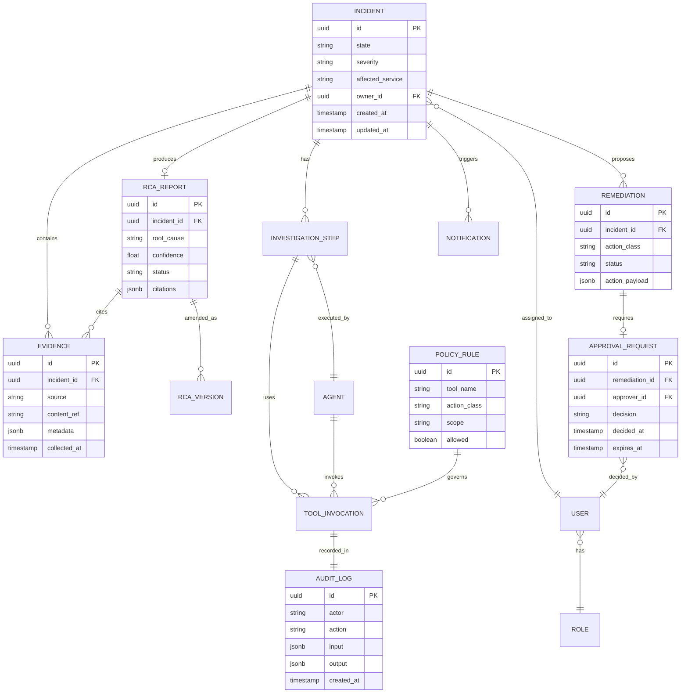

---

## 7. End-to-end incident sequence

Complete flow from alert to resolution.

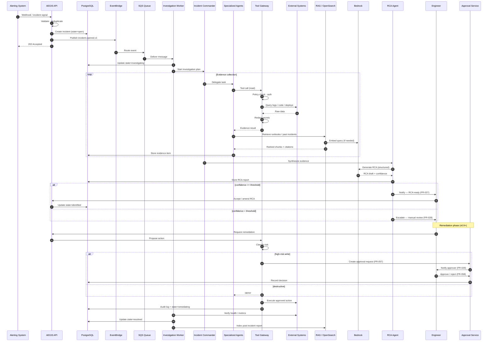

---

## 8. Multi-agent orchestration

How agents collaborate under the Incident Commander.

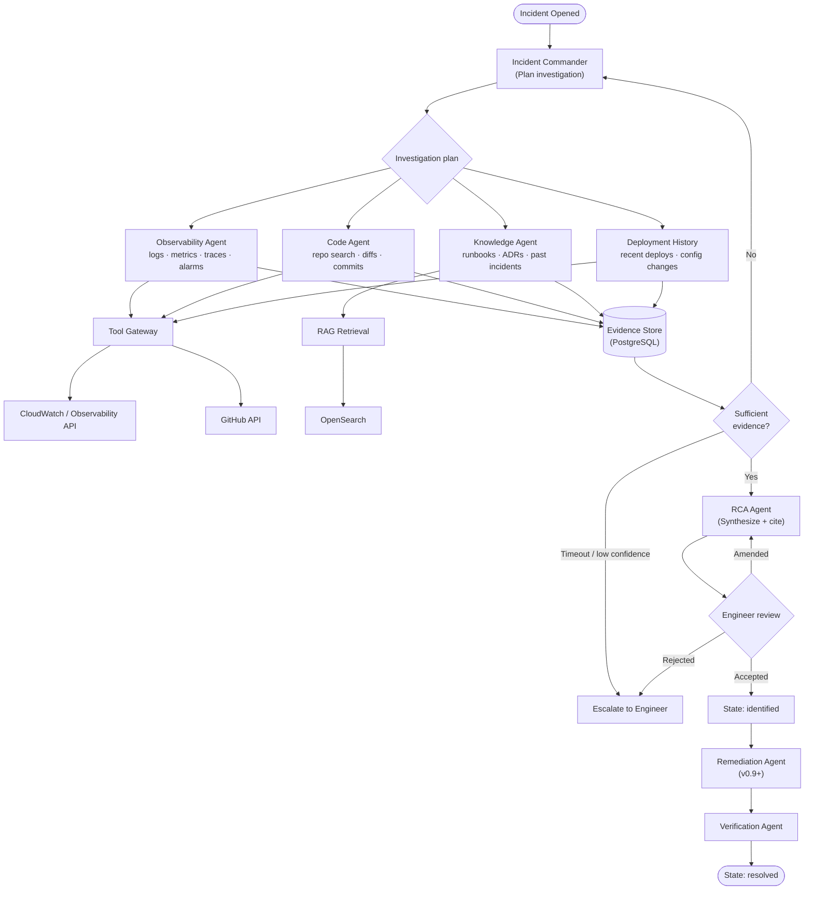

---

## 9. Event-driven architecture

Async processing via EventBridge and SQS (ADR-003).

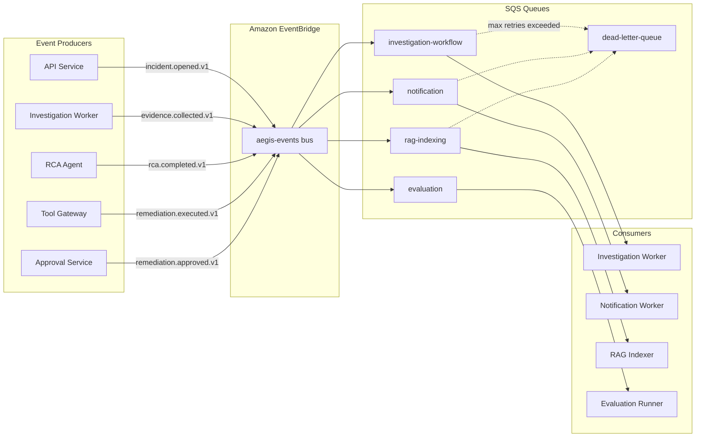

### Event catalog (quick reference)

| Event | Queue | Consumer |
|---|---|---|
| `incident.opened.v1` | investigation-workflow | Investigation Worker |
| `evidence.collected.v1` | investigation-workflow | Investigation Worker |
| `rca.completed.v1` | notification | Notification Worker |
| `rca.escalated.v1` | notification | Notification Worker |
| `remediation.proposed.v1` | notification | Notification Worker |
| `incident.resolved.v1` | rag-indexing | RAG Indexer |
| `incident.closed.v1` | rag-indexing | RAG Indexer |

---

## 10. Tool gateway & security flow

Every external action passes through policy enforcement.

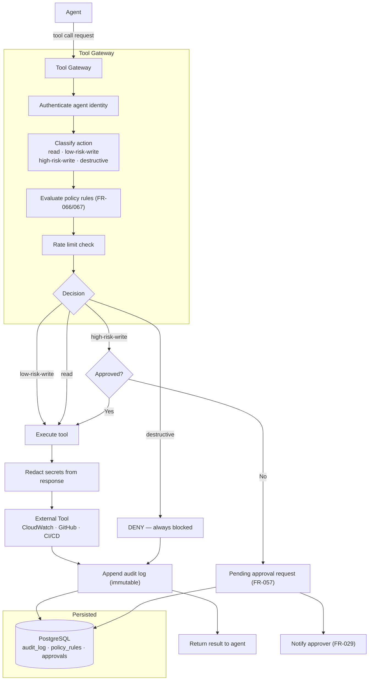

---

## 11. RAG pipeline

Knowledge ingestion, indexing, and retrieval.

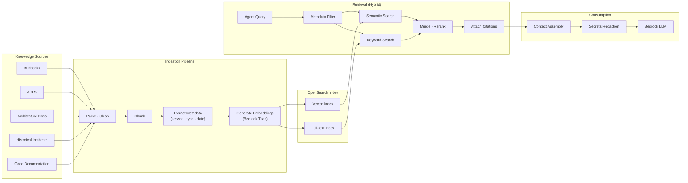

---

## 12. AWS deployment topology (target)

Production infrastructure on AWS (v0.7+).

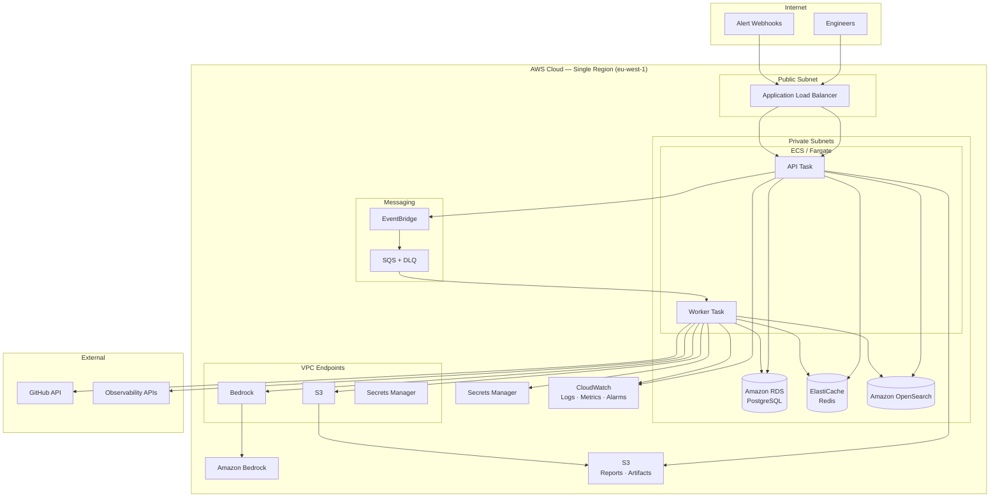

---

## 13. Production simulator (dev/test)

Synthetic environment for development and evaluation.

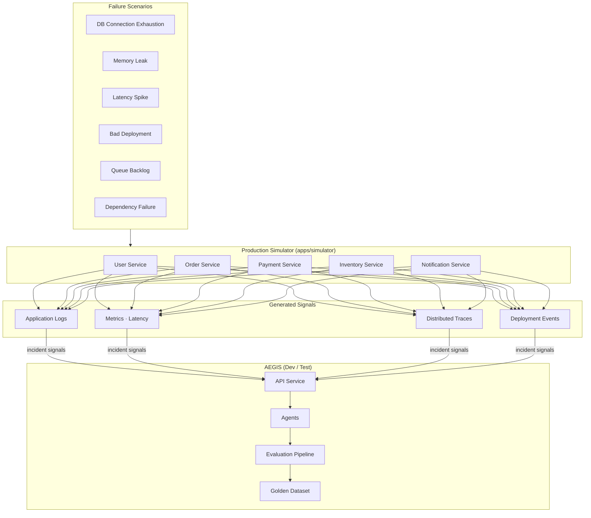

---

## 14. Complete platform map (single view)

High-level one-page reference tying everything together.

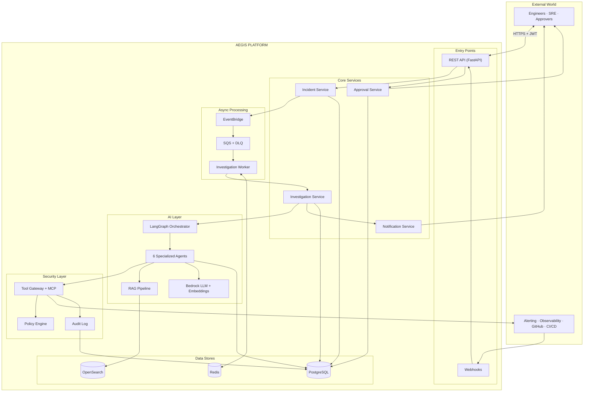

---

## Related documents

- [System context (C4 Level 1)](context.md)
- [System boundaries](system-boundaries.md)
- [Incident flow](incident-flow.md)
- [Functional requirements](../requirements/functional-requirements.md)
- [Threat model](../security/threat-model.md)
- [ADR-001: Modular monolith](../adr/ADR-001-modular-monolith.md)
- [ADR-002: PostgreSQL](../adr/ADR-002-postgresql.md)
- [ADR-003: Event-driven investigation](../adr/ADR-003-event-driven-investigation.md)
- [ADR-004: AWS Bedrock](../adr/ADR-004-aws-bedrock.md)

---

## Diagram maintenance

Update this document when:

- A new ADR changes infrastructure or integration patterns
- New services or agents are added to the platform
- Database schema changes affect the entity model
- New external integrations are introduced

When updating diagrams, increment the **Last updated** date and reference the triggering ADR or requirement.
